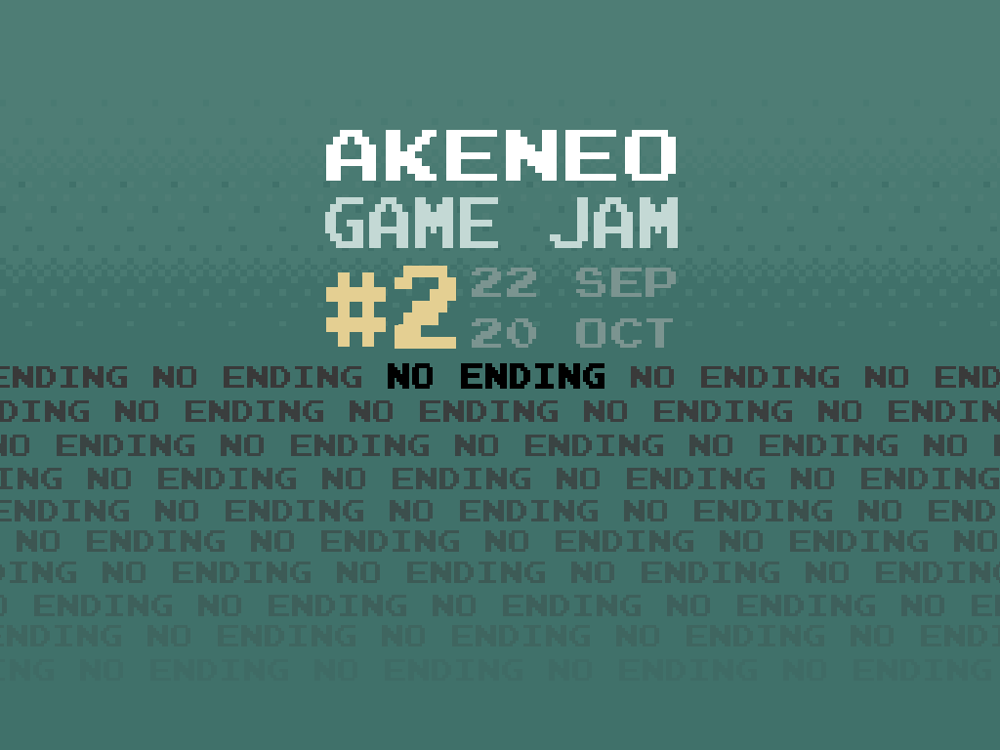

# Vasco

Small endless exploration game rushly developed #uglyCodeAndBugsInside with Typescript + Phaser JS for the Akeneo Game Jam #2.




# Demo

You can access to the demo here https://nidup.github.io/vasco/

The state of the project is more a POC regarding map generation than a playable game.

The demo is deployed on the `gh-pages` branch versionning the `build/bundles.js` file (npm run build to update).

# Getting Started

### Pre-requisites

You need to have `node` and `npm` installed

### Dependencies

To install dependencies, run:
```
npm install
```

This will install all required local dependencies

### Building the project

To build project you can use:

```
npm run build
```

### Running in dev mode:

```
npm run dev
```

# Artwork and special thanks

Thx @grena for the Game Jam org!

Thx @wlk for the following boilerplate https://github.com/wlk/phaser-typescript-boilerplate

Thx Daniel Cook for the remastered Art Work of Tyrian http://www.lostgarden.com/2007/04/free-game-graphics-tyrian-ships-and.html

Thx @Chmood for the inspiration for ground map generator and related tileset https://github.com/Chmood/shmup
